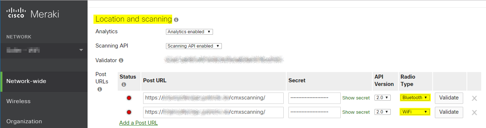

# ioBroker.merakicmx

[](https://www.npmjs.com/package/iobroker.merakicmx)
[](https://www.npmjs.com/package/iobroker.merakicmx)
[](https://david-dm.org/MiGoller/iobroker.merakicmx)
[](https://snyk.io/test/github/MiGoller/ioBroker.merakicmx)
[](https://travis-ci.org/MiGoller/ioBroker.merakicmx)

[](https://nodei.co/npm/iobroker.merakicmx/)

## Cisco Meraki CMX Scanning API adapter for ioBroker

An ioBroker adapter for the [Cisco Meraki CMX Scanning API](https://documentation.meraki.com/MR/Monitoring_and_Reporting/Location_Analytics).

## Description

This adapter exposes a receiver for the [Cisco Meraki CMX Scanning API](https://documentation.meraki.com/MR/Monitoring_and_Reporting/Location_Analytics). The [Cisco Meraki CMX Scanning API](https://documentation.meraki.com/MR/Monitoring_and_Reporting/Location_Analytics) pushes location and analytics information for any wireless devices seen by your cloud managed [Cisco Meraki access points](https://meraki.cisco.com/products/wireless#models).

Depending on the access points' feature sets the API pushes information for Wifi and Bluetooth devices like BLE beacons, etc. .

The adapter transforms the device information into ioBroker states. Any states will get updated typically in between 1 up to 2 minutes.

## Installation

Right now you'll have to add the adapter to your ioBroker using a custom URL pointing to the corresponding [GitHub](https://github.com/) repository at https://github.com/MiGoller/ioBroker.merakicmx/tree/master .

The adapter does not incorporates any ioBroker Web or Socket adapters. The adapter creates a small dedicated web-service endpoint to be exposed to an public endpoint. 

Read the disclaimer, please!

### Install the Node JS package on the command line

If you don't want to install the adapter using the web UI or if you want to install a special version, including development version, you can do so on the command line.

1. Login to your ioBroker host
2. Switch to ioBroker's installation directory (defaults to `/opt/iobroker`)
3. Run the following commands
    ```
    	iobroker npm install migoller/iobroker.merakicmx --loglevel error --prefix "/opt/iobroker"
    ```
4. Add an instance using the web UI

If you want to install the development version just type ...
```
	iobroker npm install migoller/iobroker.merakicmx#develop --loglevel error --prefix "/opt/iobroker"
```

## Configuration

### Setting up a reverse proxy
Set up a reverse proxy to protect your receiver for the [Cisco Meraki CMX Scanning API](https://documentation.meraki.com/MR/Monitoring_and_Reporting/Location_Analytics) and your ioBroker installation.

### Setting up the Cisco Meraki CMX Scanning API
First of all you'll have to enable the Cisco Meraki CMX Scanning API.

Login to your Cisco Meraki Dashboard and navigate to the general settings. Scroll down to ```location and analytics```.
1. Ensure to enable ```Analytics``` and ```Scanning API```.
2. Copy and write down the ```Validator``` phrase.
3. Add a Post URL pointing to your public endpoint (e.g. your reverse proxy's public IP or CNAME). Enter a ```Secret```for that Post URL and select API version 2.0. Select ```WiFi```as Radio Type.
4. Add another Post URL for your ```Bluetooth``` devices pointing to the same location as the previously added Post URL. Ensure the ```Secret``` is the same.



### Setting up the receiver
Finally set up the receiver. 
- Type in the ```Validator``` and the ```Secret``` you have entered in the Meraki Dashboard.
- Select the IP, port and the route the adapter will listen on for Meraki API request.
- The regular expressions for filtering the Wifi and Bluetooth devices have not reached production level.
- Check if you want the receiver to report only ```connected``` WiFi devices (recommended). In that case the adapter will report only device connected to one of your SSIDs and with a valid IP-address.
- Set the amount of time the adapter will consider a device as offline, when there's no more report.
- Set the interval on how often to check for offline devices.


## Disclaimer
I strongly recommend to put the receiver in behind of a reverse proxy like [NGINX Reverse Proxy](https://docs.nginx.com/nginx/admin-guide/web-server/reverse-proxy/) or [Traefik](https://traefik.io/). Do not forget to configure HTTPS & TLS properly to encrypt any public network traffic to your reverse proxy.

I strongly recommend to never expose any native ioBroker services to public endpoints. Don't do that!

The Cisco Meraki wireless access points will report any WiFi device in range, even if the devices are not connected to any of your SSIDs. This is great in some situations like burglar or robbery to provide wireless fingerprints of any device around at that special point of time. But you'll get a lot devices in your database.

## Changelog

### 0.2.6
* (MiGoller) Updated README.md and LICENSE files

### 0.2.5
* (MiGoller) Updated README.md

### 0.2.4
* (MiGoller) Bump lodash from 4.17.15 to 4.17.19
* (MiGoller) Upgraded several packages to wanted versions.

### 0.2.3
* (MiGoller) Bugfix issue #10: Adapter is flapping

### 0.2.2
* (MiGoller) Bugfix for issue #8: Check Adapter with js-controller 3.0.x.
* (MiGoller) Updated packages and dependencies.

### 0.2.1
* (MiGoller) Enhancement issue #4: Verify the connection to Meraki API. Thx to rookie50 for submitting feedback.
* (MiGoller) Some minor bugfixes and enhancements.

### 0.1.3
* (MiGoller) Added Meraki CMX API raw data (JSON) as status per device.
* (MiGoller) Added integration of the Places-adapter.

### 0.1.2
* (MiGoller) Bugfix missing dependencies.

### 0.1.1
* (MiGoller) First release reporting WiFi and Bluetooth devices.

### 0.0.1
* (MiGoller) initial release

## License
MIT License

Copyright (c) 2019-2020 MiGoller <goller.michael@gmail.com>

Permission is hereby granted, free of charge, to any person obtaining a copy
of this software and associated documentation files (the "Software"), to deal
in the Software without restriction, including without limitation the rights
to use, copy, modify, merge, publish, distribute, sublicense, and/or sell
copies of the Software, and to permit persons to whom the Software is
furnished to do so, subject to the following conditions:

The above copyright notice and this permission notice shall be included in all
copies or substantial portions of the Software.

THE SOFTWARE IS PROVIDED "AS IS", WITHOUT WARRANTY OF ANY KIND, EXPRESS OR
IMPLIED, INCLUDING BUT NOT LIMITED TO THE WARRANTIES OF MERCHANTABILITY,
FITNESS FOR A PARTICULAR PURPOSE AND NONINFRINGEMENT. IN NO EVENT SHALL THE
AUTHORS OR COPYRIGHT HOLDERS BE LIABLE FOR ANY CLAIM, DAMAGES OR OTHER
LIABILITY, WHETHER IN AN ACTION OF CONTRACT, TORT OR OTHERWISE, ARISING FROM,
OUT OF OR IN CONNECTION WITH THE SOFTWARE OR THE USE OR OTHER DEALINGS IN THE
SOFTWARE.